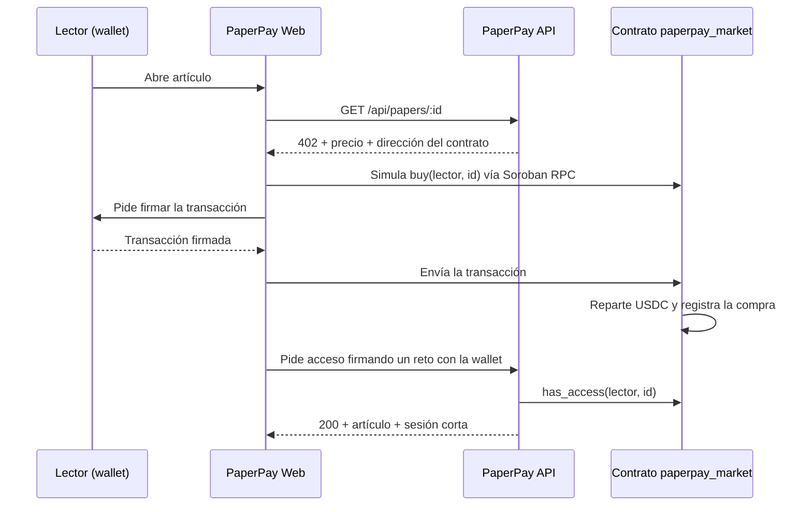

# PaperPay · Diseño del contrato Soroban (propuesta)

> **Propuesta para revisión (28 sep 2026).** Nada de esto está implementado. Hoy PaperPay usa transferencias clásicas de USDC a una cuenta de tesorería; el estado actual está en el [README](../README.md) y en [QA](QA.md).

## Objetivo

Un solo contrato, `paperpay_market`, que en la misma transacción:

1. **Cobre y reparta** el pago: la parte de la editorial va directo a su cuenta y la comisión a PaperPay.
2. **Registre la compra** en la cadena: "la wallet X compró el artículo Y".

## Qué resuelve

| Problema actual | Con el contrato |
| --- | --- |
| El reparto 98/2 solo es un cálculo en el panel editorial; todo el dinero llega a la tesorería. | El contrato transfiere a la editorial y a PaperPay en la misma operación. El reparto se ve en el ledger. |
| El ledger no dice qué artículo se pagó. | Cada compra queda ligada a `(comprador, artículo)` y emite un evento. |
| Los hashes verificados se guardan en memoria: un redeploy los borra, y por eso existe la ventana de 5 minutos (`PAYMENT_VERIFICATION_MAX_AGE_SECONDS`) que causa el error "La transacción no está dentro del periodo de pago permitido". | No hace falta verificar hashes: el contrato registra la compra una sola vez y cualquiera puede consultarla. La ventana de tiempo desaparece. |
| El acceso depende de un JWT de 24 horas firmado con `JWT_SECRET`. | El derecho de lectura es permanente y está en la cadena ("pagas una vez, es tuyo"). El JWT queda solo como sesión corta. |

## Datos del contrato

| Clave | Contenido | Almacenamiento |
| --- | --- | --- |
| `Admin` | Cuenta que administra el contrato (idealmente multifirma). | instance |
| `Token` | Dirección del contrato de USDC (SAC). En Testnet: `CBIELTK6YBZJU5UP2WWQEUCYKLPU6AUNZ2BQ4WWFEIE3USCIHMXQDAMA`. | instance |
| `Treasury` | Cuenta que recibe la comisión de PaperPay. | instance |
| `Publisher(id)` | `{ payout: Address, fee_bps: u32 }`: cuenta de la editorial y comisión de PaperPay en puntos base (200 = 2%). | persistent |
| `Paper(id)` | `{ publisher_id: String, price: i128 }`: editorial y precio en unidades de 7 decimales (5,000,000 = 0.50 USDC). | persistent |
| `Purchase(buyer, paper_id)` | `{ amount: i128, ledger: u32 }`: la compra. | persistent |

Los IDs de artículo son `String`, no `Symbol`: los actuales tienen guiones y hasta 48 caracteres, y un `Symbol` admite máximo 32 caracteres alfanuméricos.

Precio y comisión viven en el contrato y son configurables por artículo y por editorial, así que 0.50 USDC y 2% son solo los valores iniciales.

## Funciones

```rust
// Boceto de la interfaz (soroban-sdk). No es código final.
pub trait PaperPayMarket {
    // Administración (requieren la firma de Admin)
    fn initialize(env: Env, admin: Address, token: Address, treasury: Address);
    fn set_publisher(env: Env, publisher_id: String, payout: Address, fee_bps: u32);
    fn set_paper(env: Env, paper_id: String, publisher_id: String, price: i128);
    fn set_admin(env: Env, new_admin: Address);
    fn upgrade(env: Env, new_wasm_hash: BytesN<32>);

    // Compra (requiere la firma del comprador)
    fn buy(env: Env, buyer: Address, paper_id: String) -> Purchase;

    // Lectura (gratis: se consultan por simulación)
    fn has_access(env: Env, buyer: Address, paper_id: String) -> bool;
    fn get_purchase(env: Env, buyer: Address, paper_id: String) -> Option<Purchase>;
    fn get_paper(env: Env, paper_id: String) -> Option<Paper>;
}
```

### `buy`, paso a paso

1. `buyer.require_auth()`: solo el dueño de la wallet puede comprar a su nombre.
2. Si ya existe `Purchase(buyer, paper_id)`, devuelve la compra existente **sin cobrar otra vez**. Esto hace seguros los reintentos del frontend.
3. Lee `Paper` y `Publisher`; falla si el artículo no está registrado.
4. Calcula `fee = price * fee_bps / 10_000` (redondeo hacia abajo, con multiplicación verificada) y `publisher_amount = price - fee`. Con 0.50 USDC y 2%: 4,900,000 a la editorial y 100,000 a PaperPay.
5. Dos transferencias con el cliente del token: `buyer → payout` y `buyer → treasury`. Si cualquiera falla (por ejemplo, falta de saldo), toda la operación se revierte.
6. Guarda `Purchase`, extiende su TTL y emite el evento `("purchase", buyer, paper_id) → (price, fee)`.

## Cómo cambia el flujo



- **Pago:** el frontend arma una llamada a `buy`, la prepara con Soroban RPC (simulación para calcular recursos y comisión), la firma con Freighter (`signTransaction`, que ya se usa hoy) y la envía.
- **Acceso:** `has_access` es público, así que no basta con decir "soy la wallet X". El lector demuestra que controla la wallet firmando un reto de la API (SEP-10 o firma de mensaje), y la API consulta `has_access`. Con eso emite una sesión corta; si expira, se repite la firma, **no el pago**.
- **Panel editorial:** lee los eventos `purchase` del contrato en lugar de las transferencias a la tesorería, así que muestra lecturas reales por artículo y el reparto real.

## Seguridad

- **Autorización:** `require_auth` en `buy` y en todas las funciones de administración.
- **Aritmética:** `i128` con operaciones verificadas; rechazar precios ≤ 0 y `fee_bps > 10_000`.
- **Clave de administración:** una cuenta multifirma; si se filtra, alguien podría cambiar precios o la cuenta de la editorial.
- **Actualizaciones:** `upgrade` (con `update_current_contract_wasm`) permite corregir errores, pero también es poder concentrado; documentarlo y protegerlo con la multifirma.
- **Archivado de estado:** las entradas `persistent` expiran si no se extiende su TTL. Hay que extenderlo al comprar y al consultar, y prever la restauración de compras archivadas para que un lector no pierda su acceso.
- **Auditoría externa** antes de mainnet.

## Costo

Una transferencia de USDC por Soroban costó ~0.0024 XLM (≈ $0.0005 con XLM a $0.20; medición del 23 sep). `buy` hace dos transferencias y una escritura persistente, así que costará algo más. Hay que medirlo en Testnet con `simulateTransaction` antes de confirmar el modelo de costos.

## Plan por fases

1. **Contrato y pruebas** (Rust, `soroban-sdk` y sus `testutils`): reparto, idempotencia, errores y TTL. Despliegue en Testnet.
2. **API:** reto de firma de wallet, acceso con `has_access` y sesión corta. Los modos actuales (`SELF_SETTLE` y Pollar) siguen funcionando para artículos no migrados.
3. **Frontend con Freighter:** compra con `buy`.
4. **Pollar:** depende de la pregunta abierta 1.
5. **Panel editorial:** leer eventos del contrato.
6. **Auditoría y mainnet.**

## Preguntas abiertas

1. **¿Pollar puede invocar contratos?** Hoy el flujo usa su `sendPayment`, que hace un pago clásico. Si Pollar no firma invocaciones de Soroban, sus usuarios seguirían por la ruta actual.
2. **¿Cómo encaja x402?** En el esquema `exact` de x402, el facilitador transfiere USDC a una dirección `payTo`. Transferir a la dirección del contrato no ejecuta `buy`, así que el reparto y el registro no ocurrirían. Hay que decidir si PaperPay ofrece x402 estándar como ruta aparte o espera un esquema que permita llamar contratos.
3. **¿Quién registra los artículos?** Solo el admin, o cada editorial con su propia firma.
4. **Reembolsos:** el contrato no los contempla. ¿Se manejan fuera de la cadena?
5. **Autores:** ¿el reparto debe admitir más de un destinatario (editorial + autores)? Cambiaría `Publisher` por una lista de destinatarios con porcentajes.
