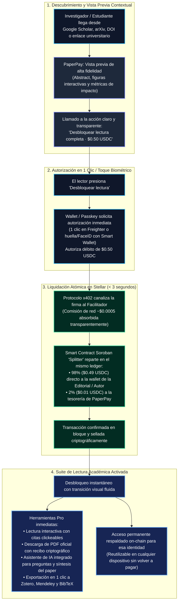
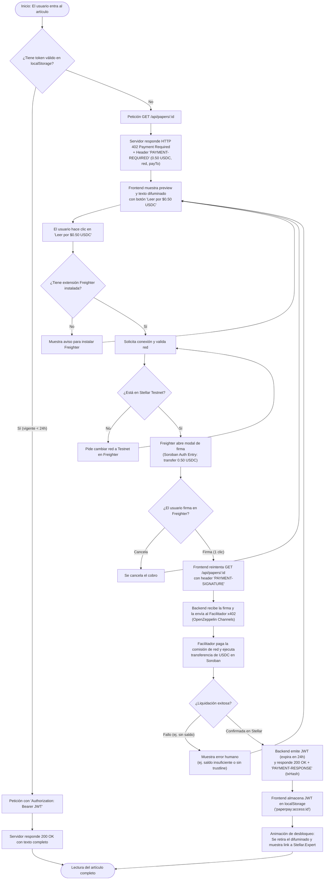

# PaperPay · Flujo del Usuario y Experiencia de Compra (x402)

> **Documento histórico (23 sep 2026).** Describe el flujo objetivo con x402 estándar. Lo implementado (v2.0.0) usa **transacciones clásicas de USDC**: con Freighter el navegador firma y la API envía a Horizon (`SELF_SETTLE`); con Pollar, Pollar envía el pago y la API lo verifica por hash. No usa los paquetes oficiales de x402, auth entries de Soroban ni un contrato Soroban. El catálogo tiene 52 artículos ficticios. El acceso dura 24 horas por artículo. Estado actual: [README](../README.md) y [QA](QA.md).

Este documento detalla la experiencia de usuario y arquitectura de compra en PaperPay, abordando tanto la **visión ideal del producto terminado en producción** como el **flujo técnico de control y manejo de excepciones** implementado para el MVP.

---

## 1. La Experiencia Ideal (Visión del Producto Terminado)

En su versión final en producción (mainnet), PaperPay elimina toda la fricción de las pasarelas de pago tradicionales: no existen formularios con tarjeta de crédito, registros por correo, contraseñas ni suscripciones mensuales forzadas. La experiencia se reduce a **un clic, tres segundos y acceso total**.

### 1.1 Diagrama del Happy Path (Producto Terminado)

### 1.2 Características clave del producto final:
* **Sin cuentas ni fricción:** La wallet (vía Freighter, Passkey o Pollar Smart Wallet) es la identidad y el método de pago simultáneamente.
* **Reparto justo e instantáneo (Splitter On-chain):** Los autores y revistas independientes reciben sus fondos al instante ($0.49 de cada $0.50), sin cortes mensuales ni intermediarios bancarios.
* **Cero comisiones visibles para el usuario:** El fee de red en XLM es absorbido de forma invisible por el facilitador/paymaster.
* **Soporte nativo para Agentes Autónomos de IA:** Gracias al estándar HTTP 402, agentes de investigación (como PaperQA o AutoGPT) pueden consultar y pagar automáticamente por papers científicos mediante API sin intervención humana.

---

## 2. Flujo Técnico de Control y Manejo de Excepciones (MVP)

A nivel de protocolo e ingeniería, el frontend y backend gestionan la verificación de estado, la emisión de cabeceras HTTP estándar y la resolución de casos de borde.

### 2.1 Diagrama de Control del Sistema

---

## 3. Desglose paso a paso del protocolo

### Paso 1: Petición inicial y detección de paywall
* El usuario navega al artículo (ej. `/papers/quantum-computing-intro`).
* La aplicación verifica si existe una clave `paperpay:access:<paperId>` válida en `localStorage`:
  * **Con token válido:** Se envía la cabecera `Authorization: Bearer <jwt>` al backend, el servidor valida los claims (`sub`, `paperId`, `exp`) y devuelve `200 OK` con el texto completo.
  * **Sin token:** Se envía `GET /api/papers/:id`. El backend responde con `HTTP 402 Payment Required`, adjuntando la cabecera estándar `PAYMENT-REQUIRED` en base64 con los requisitos de pago:
    * Monto: `5000000` (0.50 USDC en unidades de 7 decimales).
    * Contrato: USDC SAC en Stellar Testnet.
    * Destino: Cuenta de tesorería de PaperPay (`payTo`).
* El frontend renderiza el título, autores, abstract y las primeras líneas del artículo, aplicando un difuminado visual (*blur*) sobre el resto y presentando el botón de llamada a la acción: **"Leer por $0.50 USDC"**.

### Paso 2: Interacción con Freighter Wallet
* Al presionar el botón de compra, la aplicación verifica la disponibilidad de la extensión `@stellar/freighter-api`.
* Si no está presente, se instruye al usuario a instalarla desde [freighter.app](https://www.freighter.app/).
* Si está presente, se solicita la conexión (`requestAccess()`) y se valida que la red activa sea **Testnet** (`stellar:testnet`). En caso contrario, se pide al usuario alternar a Testnet en la interfaz de Freighter.

### Paso 3: Autorización y firma x402 (Soroban)
* Freighter solicita al usuario autorizar una entrada de invocación (*Auth Entry*) de Soroban:
  `USDC.transfer(from: lector, to: paperpay, amount: 5000000)`.
* **Cero comisiones para el lector:** El usuario solo autoriza la transferencia de $0.50 USDC; no necesita saldo en XLM para pagar comisiones de transacción.
* El usuario confirma con 1 solo clic en la ventana de Freighter.

### Paso 4: Liquidación y verificación
* El cliente web captura la `AuthEntry` firmada y repite la petición original:  
  `GET /api/papers/:id` con la cabecera `PAYMENT-SIGNATURE` (payload x402 v2).
* El middleware del backend (`@x402/express` + `@x402/stellar`) recibe la firma y la canaliza al **Facilitador x402** (OpenZeppelin Channels en testnet).
* El facilitador patrocina la comisión de red, incorpora la autorización a una transacción de Soroban y la envía a la red de Stellar.
* **Modo de respaldo (`SELF_SETTLE`):** Si el servicio del facilitador presentase indisponibilidad durante la demo, el servidor backend firma la envolvente de la transacción con su propia cuenta operadora y la somete directamente a la red.

### Paso 5: Desbloqueo y persistencia
* Al confirmarse la transacción en Stellar, el servidor genera un **token de acceso JWT** firmado, ligado al hash de la transacción, al ID del artículo y a la clave pública del lector, con una vigencia de 24 horas.
* El servidor responde `200 OK` junto con:
  * Cabecera `PAYMENT-RESPONSE` conteniendo el hash de la transacción (`txHash`).
  * Cuerpo con el artículo completo y el token JWT.
* El frontend guarda el JWT en `localStorage`.
* La interfaz ejecuta una animación de desbloqueo, retira el difuminado, presenta el contenido completo y provee un enlace directo a [Stellar.Expert](https://stellar.expert/explorer/testnet) para auditar la transacción en el explorador de bloques.

---

## 4. Manejo de errores y casos de borde

| Escenario | Comportamiento del sistema | Acción para el usuario |
|---|---|---|
| **Freighter no detectado** | Banner informativo y botón bloqueado. | Enlace directo a la tienda de extensiones para instalar Freighter. |
| **Red incorrecta (Mainnet/Futurenet)** | Modal de advertencia de red. | Instrucciones para cambiar a *Testnet* dentro de Freighter. |
| **Saldo insuficiente de USDC** | Alerta descriptiva con saldo actual vs requerido ($0.50 USDC). | Enlace al [Faucet de Circle](https://faucet.circle.com/) (Stellar Testnet). |
| **Falta de Trustline a USDC** | Detección de ausencia de línea de confianza para el activo USDC. | Guía rápida o botón para añadir trustline a USDC SAC. |
| **Firma cancelada por el usuario** | Se restablece el estado del botón sin alterar la vista previa. | Puede volver a intentar en cualquier momento sin recargar. |
| **Expiración de token JWT (> 24h)** | El servidor responde nuevamente con `402 Payment Required`. | Se remueve el token expirado de `localStorage` y se muestra el paywall para una nueva compra. |

---

## 5. Referencias técnicas
* [docs/PLAN.md](PLAN.md): Decisiones de Arquitectura (ADR-01 a ADR-05) y especificación de endpoints.
* [docs/RESUMEN_EJECUTIVO.md](RESUMEN_EJECUTIVO.md): Desglose de costos y unit economics por microtransacción.
* [Especificación oficial x402](https://x402.org): Protocolo de pagos condicionales vía HTTP 402.
