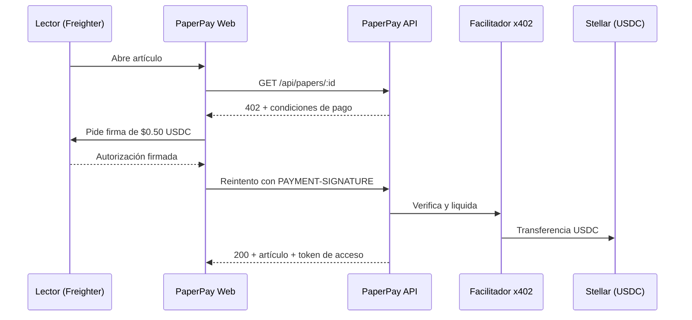

# PaperPay · Resumen ejecutivo

_Actualizado: 23 sep 2026 · Versión editable para comentarios: [Claude Docs](https://claude.ai/code/artifact/764894f4-f397-4a1f-b9ad-1a4472fb7118)_

PaperPay permite leer un artículo científico pagando $0.50 USDC en un clic, sin crear cuenta, usando el estándar HTTP 402 y el protocolo x402 sobre Stellar. Es una propuesta de dos exalumnos de la Facultad de Ingeniería de la UNAM para el track Stellar de Goya Hack 2026.

## Problema y oportunidad

Leer un solo artículo detrás del paywall de una editorial académica cuesta entre $30 y $50 USD. Para un estudiante o investigador que necesita consultar un artículo de vez en cuando, ni el pago por artículo ni la suscripción tienen sentido.

- **Suscripciones:** son caras e ineficientes para lectores ocasionales.
- **Pagos con tarjeta:** las pasarelas como Stripe cobran una comisión fija de alrededor de $0.30 más un porcentaje, así que un cobro de centavos no es viable.
- **Cuentas:** cada editorial pide registro con email y contraseña antes de pagar.

La oportunidad está en un precio que hoy nadie puede cobrar: centavos por lectura, liquidados al instante.

## Solución

El lector ve el resumen del artículo, hace clic en "Leer por $0.50 USDC", firma en su wallet Freighter y el texto se desbloquea en segundos. No hay registro, no hay tarjeta y el lector no paga comisión de red.

El servidor responde con el código estándar HTTP 402 "Payment Required". Un facilitador x402 verifica la firma, envía la transacción y paga la comisión de red. El lector recibe un token que le da acceso al artículo por 24 horas.

## Diferenciadores

PaperPay usa estándares abiertos de la web en lugar de una pasarela propia, y eso lo hace reutilizable por cualquier revista.

- **HTTP 402 + x402:** es el estándar abierto de pagos por solicitud. El mismo endpoint sirve a personas desde el navegador y a agentes de IA que compran artículos sin intervención humana.
- **Stellar:** comisión de red de alrededor de $0.0005 por pago (0.1% de una lectura) y liquidación en unos 5 segundos. USDC es nativo en la red.
- **Sin cuentas:** la wallet es la identidad y el pago es el acceso.
- **Impacto UNAM:** un estudiante paga $0.50 por el artículo que necesita, en vez de $30 a $50 o de depender de la suscripción de su biblioteca.

## Modelo de negocio

PaperPay gana con un porcentaje de cada lectura cobrada y con licencias para quienes publican.

| Fuente de ingreso | Cómo funciona | Cliente |
| --- | --- | --- |
| Fee de infraestructura | 1.5% a 2% de cada micro-transacción (alrededor de $0.01 por lectura de $0.50) | Todas las editoriales que cobran con PaperPay |
| SaaS / Dashboard | Licencia para publicar artículos, fijar precios y ver ingresos | Revistas independientes y universidades |

En el MVP el pago llega a una tesorería de PaperPay y el reparto con la editorial se lleva fuera de la red. El roadmap incluye un contrato en Soroban que reparta 98% a la editorial y 2% a PaperPay en la misma transacción.

### Costos y margen por lectura (medidos el 23 sep 2026)

Simulación de una transferencia real de 0.50 USDC (SAC) en Stellar mainnet: **~24,300 stroops = 0.0024 XLM ≈ $0.0005 USD** (XLM a $0.20). La cifra de $0.00001 aplica solo a pagos clásicos, no a Soroban.

| Opción de facilitador | Costo del servicio | Comisión de red | Total por pago |
|---|---|---|---|
| OpenZeppelin Channels (hospedado) | Sin precio publicado; gratis en testnet | La paga OpenZeppelin | $0 hoy; confirmar tarifa en mainnet |
| OpenZeppelin autohospedado / `SELF_SETTLE` | $0 + servidor (~$5 a $20 al mes) | La paga PaperPay | ~$0.0005 |
| Escenario conservador (tarifa tipo Coinbase) | $0.001 | ~$0.0005 | **~$0.0015** |

Coinbase cobra $0.001 por pago (1,000 gratis al mes) pero **no soporta Stellar**; se usa solo como referencia de mercado.

| Por lectura de $0.50 | USD |
|---|---|
| Paga el lector | 0.5000 |
| Editorial (98%) | 0.4900 |
| Ingreso bruto PaperPay (2%) | 0.0100 |
| − Comisión de red | −0.0005 |
| − Facilitador (conservador) | −0.0010 |
| **Margen neto PaperPay** | **0.0085 (85% del fee)** |

| Lecturas al mes | Ingreso PaperPay | Costo red + facilitador | Margen neto |
|---|---|---|---|
| 10,000 | $100 | $15 | $85 |
| 100,000 | $1,000 | $150 | $850 |
| 1,000,000 | $10,000 | $1,500 | $8,500 |

- **Precio mínimo viable:** con fee de 2% y costo de $0.0015, el modelo funciona desde $0.075 por lectura.
- **Riesgo XLM:** si XLM duplica su precio, la red cuesta ~$0.001 y el margen baja de 85% a 80%.
- Con el contrato splitter (roadmap) serían dos transferencias por pago y la comisión de red sube un poco.

## Alcance del MVP (entrega viernes 25, 14:00)

El MVP demuestra el ciclo completo en Stellar Testnet: artículo bloqueado, pago real, desbloqueo y transacción visible en el explorador.

| Entra al MVP | Queda en roadmap |
| --- | --- |
| Catálogo de 3 a 5 artículos de acceso abierto (arXiv, CC-BY) | Contrato Soroban que reparte 98/2 en la red |
| Paywall con respuesta HTTP 402 y vista previa | Descarga de PDF protegido |
| Pago x402 con Freighter y facilitador | Agentes de IA que pagan vía x402 |
| Token de acceso por 24 horas | Segunda wallet de pago (Pollar) |
| Pantalla de ingresos de la editorial con datos de ejemplo | Dashboard SaaS completo |

Stack: Next.js y Tailwind en el frontend, Express y TypeScript en el backend, con las librerías oficiales `@x402/express`, `@x402/stellar` y `@stellar/freighter-api`.

## Equipo y plan de ejecución

Dos exalumnos de la Facultad trabajan en paralelo sobre un contrato de API compartido, con 31 tareas en [GitHub Projects](https://github.com/users/josecadenax/projects/2).

| Fase | Cierre (CDMX) | Resultado |
| --- | --- | --- |
| F0 Setup | Mié 23, 22:00 | Repo, contrato de API, wallets de prueba y requisito Tangem cumplido |
| F1 Core | Jue 24, 14:00 | API responde 402 y liquida; frontend muestra el paywall |
| F2 Integración | Jue 24, 23:00 | Pago real de principio a fin, desplegado |
| F3 Demo | Vie 25, 12:00 | Video, slides y entrega, 2 horas antes del cierre |

- **Dev A (backend y protocolo):** API, middleware x402, verificación y token de acceso.
- **Dev B (frontend y wallet):** interfaz de lectura, paywall, conexión con Freighter y flujo de pago.

## Riesgos y mitigaciones

| Riesgo | Mitigación |
| --- | --- |
| El facilitador x402 falla durante la demo en vivo | Modo de respaldo en el que el servidor envía la transacción, más un video grabado |
| Preparar la wallet (trustline, faucet) confunde al jurado | Wallet de demo precargada con USDC de testnet |
| El texto completo se filtra al navegador | El servidor solo envía la vista previa hasta recibir el pago |
| Freighter móvil no soporta x402 | La demo se hace en escritorio con la extensión |
| Contenido con derechos de autor | Solo artículos de acceso abierto en la demo |

## Preguntas para el mentor

1. ¿El alcance del MVP es realista para el viernes, o conviene recortar algo más?
2. ¿El jurado de Stellar valora más un contrato Soroban propio (el reparto 98/2) que el uso de x402 con facilitador?
3. ¿Cuánto cobra OpenZeppelin por el facilitador en mainnet, o conviene autohospedarlo?
4. ¿La historia de impacto para la comunidad UNAM se entiende, o hay un ángulo más fuerte?
5. ¿Podemos participar como exalumnos y competir en más de un track?
6. ¿Qué esperan ver en el pitch para el acceso a la aceleradora Instaward?

## Fuentes

- [Bases de Goya Hack 2026](https://criptounam.xyz/hackathon)
- [x402 en Stellar (Stellar Docs)](https://developers.stellar.org/docs/build/agentic-payments/x402)
- [Facilitador x402 de OpenZeppelin](https://docs.openzeppelin.com/relayer/guides/stellar-x402-facilitator-guide)
- Plan técnico completo: [docs/PLAN.md](PLAN.md)
